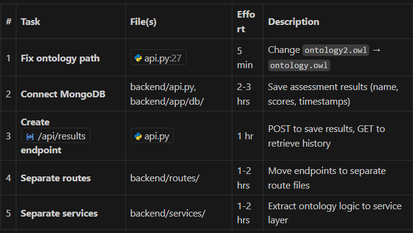
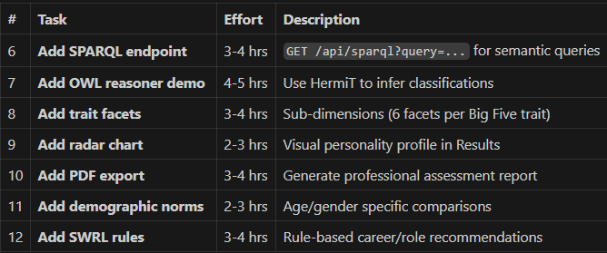
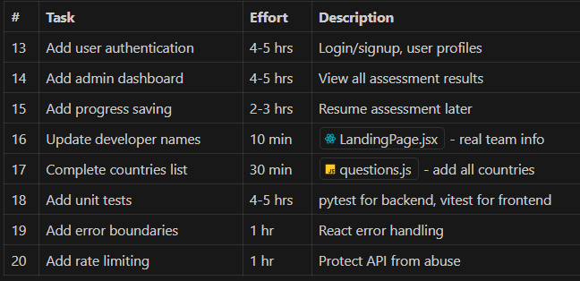
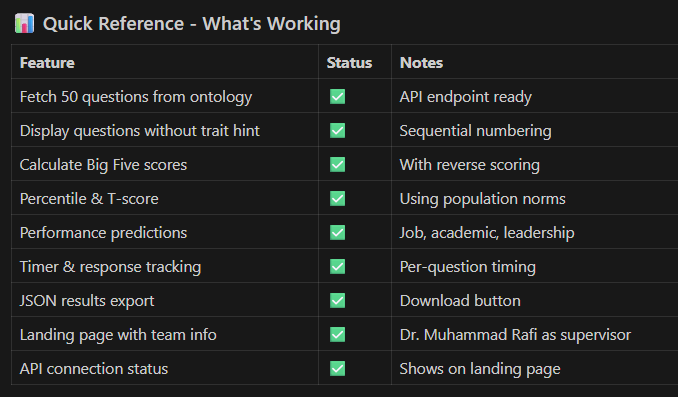

# Things to work on later

## Quick Start

### Backend
```powershell
# PowerShell (Windows)
cd backend
.\run.ps1

# Or manually:
uvicorn api:app --host 0.0.0.0 --port 8000 --reload
```

```bash
# Bash (Linux/Mac)
cd backend
./run.sh

# Or manually:
uvicorn api:app --host 0.0.0.0 --port 8000 --reload
```

**Important:** Always use `--host 0.0.0.0` to make the backend accessible from the network!

### Frontend
```bash
cd frontend
npm run dev
```

---

# BACKEND
```
connect mongodb
seperate the fastapi file
seperate the ontology extraction file
make database to store name, scores, answers of each, timestamp, each answer timestamp, percentile
```


# FRONTEND
make the frontend more better


## TODO LIST GIVEN BY LLM

🎯 Project Status Overview
Component	Completion	Status
OWL Ontology	100%	✅ All 50 IPIP questions, norms, correlations
FastAPI Backend	85%	⚠️ Needs restructuring, ontology path fix
React Frontend	95%	✅ All UI components complete
Database	10%	❌ MongoDB configured but not integrated
KRR Demonstration	70%	⚠️ Missing SPARQL/reasoner features
Overall: ~75% Complete

🌟 Unique Features (What Makes This Project Stand Out)
Already Implemented:
Ontology-Driven Architecture - Questions, norms, and scoring loaded entirely from OWL ontology (not hardcoded)
Meta-Analytic Predictions - Predicts job/academic/leadership performance using real research correlations with study counts
Statistical Rigor - Z-scores, percentiles, T-scores using population norms (N=23,994)
Response Timing Analytics - Tracks per-question timing for research validity
Research Transparency - Shows confidence intervals and number of studies for each prediction
For Academic Excellence (Add These):
SPARQL Queries - Demonstrate semantic querying capabilities
OWL Reasoner Integration - Automatic inference using HermiT/Pellet
SWRL Rules - Rule-based recommendations (e.g., career matching)


# 🔴 HIGH PRIORITY (Do First)
###	Task	File(s)	Effort	Description


# 🟡 MEDIUM PRIORITY (Academic Enhancement)
###	Task	Effort	Description



# 🟢 LOW PRIORITY (Polish)
###	Task	Effort	Description



# 📁 Recommended Backend Restructure
```
backend/
├── api.py                      # Entry point (minimal)
├── ontology.owl                # ← Fix: use this name
├── app/
│   ├── db/
│   │   └── mongodb.py          # MongoDB connection & operations
│   ├── routes/
│   │   ├── questions.py        # GET /api/questions
│   │   ├── assessment.py       # POST /api/submit
│   │   ├── results.py          # GET/POST /api/results (NEW)
│   │   └── sparql.py           # GET /api/sparql (NEW)
│   └── services/
│       ├── ontology_service.py # Load & query ontology
│       ├── scoring_service.py  # Calculate scores
│       └── reasoner_service.py # OWL reasoning (NEW)
```

# To make this a standout KRR project, implement these 4 features:

1. SPARQL Query Endpoint

# Demonstrate semantic queryingGET /api/sparql?query=SELECT ?q WHERE { ?q :measuresTrait :Extraversion }
2. OWL Reasoner Integration
Use owlready2's HermiT reasoner
Automatically classify individuals
Infer personality type based on scores
3. SWRL Rules for Recommendations

Person(?p) ∧ hasConscientiousness(?p, ?c) ∧ greaterThan(?c, 80)   → recommendRole(?p, "Project Manager")
4. Ontology Visualization
Generate ontology graph visualization
Show class hierarchy and relationships





# 🚀 Suggested Implementation Order
Week 1:

 Fix ontology path bug (5 min)
 Restructure backend folders (3-4 hrs)
 Connect MongoDB (2-3 hrs)
Week 2:

 Add SPARQL endpoint (3-4 hrs)
 Add radar chart visualization (2-3 hrs)
 Add PDF export (3-4 hrs)
Week 3:

 Add OWL reasoner demo (4-5 hrs)
 Add trait facets to ontology (3-4 hrs)
 Add SWRL rules (3-4 hrs)
Week 4:

 Polish UI, update team info
 Write documentation
 Prepare presentation
